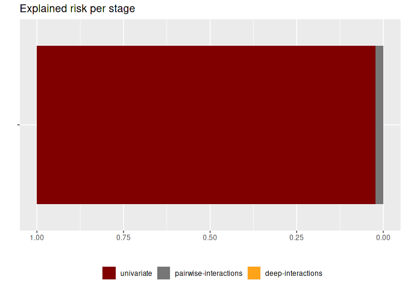
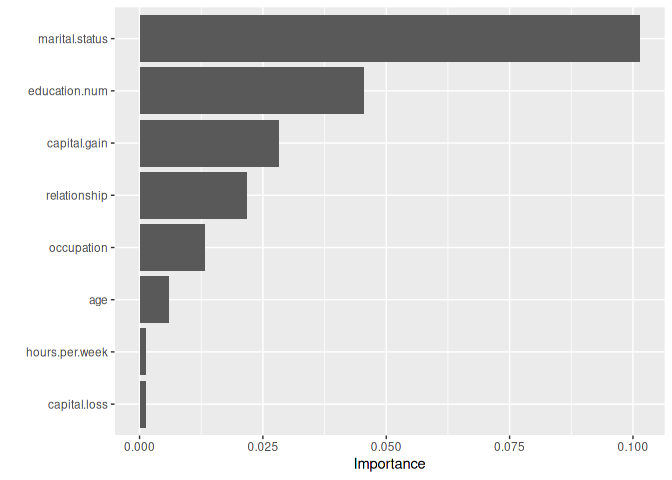
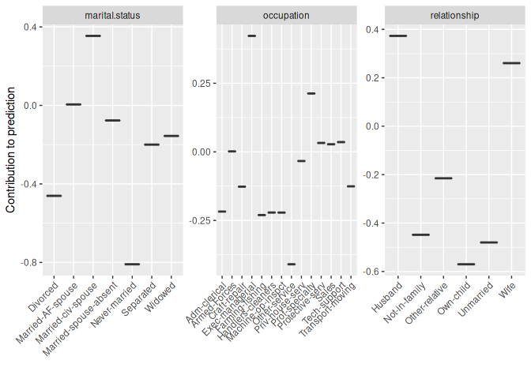
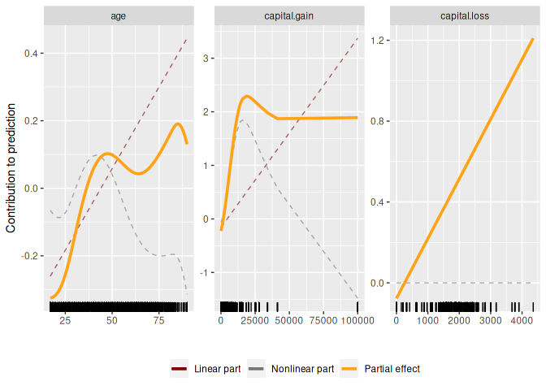
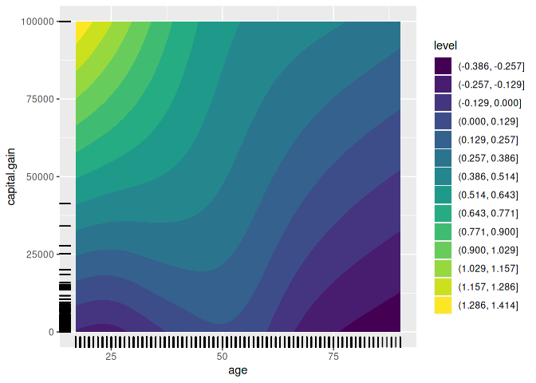

<!-- README.md is generated from README.Rmd. Please edit that file -->

# autocompboost

### Use case

``` r
# Use airlines task from OpenML:
#task = tsk("oml", task_id = 189354) # airlines
#task = tsk("oml", task_id = 31) # credig-g
#task = tsk("oml", task_id = 14965) # bank-marketing
task = tsk("oml", task_id = 7592) # adult
#> INFO  [14:19:10.338] Retrieving JSON {url: https://www.openml.org/api/v1/json/task/7592, authenticated: FALSE}
#> INFO  [14:19:10.417] Retrieving JSON {url: https://www.openml.org/api/v1/json/data/1590, authenticated: FALSE}
#> INFO  [14:19:10.500] Retrieving ARFF {url: https://www.openml.org/data/v1/download/1595261/adult.arff, authenticated: FALSE}

task$filter(which(complete.cases(task$data())))

# Train compboost learner:
set.seed(31415)
cboost = lrn("classif.compboost", predict_type = "prob", show_output = TRUE,
  learning_rate_univariate = 0.01, learning_rate_interactions = 0.01,
  learning_rate_deeper_interactions = 0.01, add_deeper_interactions = TRUE,
  stop_epsylon_for_break = 0, stop_patience = 3L, df = 4)
cboost$train(task)
#>     1/50000   risk = 0.56  minutes = 0   oob_risk = 0.56
#>  1250/50000   risk = 0.38  minutes = 0   oob_risk = 0.37
#>  2500/50000   risk = 0.36  minutes = 0   oob_risk = 0.36
#>  3750/50000   risk = 0.36  minutes = 0   oob_risk = 0.35
#>
#>
#> Train 4536 iterations in 17 Seconds.
#> Final risk based on the train set: 0.36
#>
#>     1/50000   risk = 0.36  minutes = 0   oob_risk = 0.35
#>
#>
#> Train 557 iterations in 12 Seconds.
#> Final risk based on the train set: 0.35
#>
#> Start risk: 0.3533  test: 0.3413
#> Tree 1: train risk: 0.3533 test risk: 0.3413 time: 0 Min. patience: 0
#> Tree 2: train risk: 0.3533 test risk: 0.3413 time: 0 Min. patience: 0
#> Tree 3: train risk: 0.3533 test risk: 0.3413 time: 0.01 Min. patience: 0
#> Tree 4: train risk: 0.3533 test risk: 0.3413 time: 0.02 Min. patience: 0
#> Tree 5: train risk: 0.3533 test risk: 0.3413 time: 0.02 Min. patience: 0
#> Tree 6: train risk: 0.3533 test risk: 0.3413 time: 0.02 Min. patience: 0
#> Tree 7: train risk: 0.3533 test risk: 0.3413 time: 0.03 Min. patience: 0
#> Tree 8: train risk: 0.3533 test risk: 0.3413 time: 0.03 Min. patience: 0
#> Tree 9: train risk: 0.3533 test risk: 0.3413 time: 0.03 Min. patience: 0
#> Tree 10: train risk: 0.3533 test risk: 0.3413 time: 0.04 Min. patience: 0
#> Tree 11: train risk: 0.3533 test risk: 0.3413 time: 0.04 Min. patience: 0
#> Tree 12: train risk: 0.3533 test risk: 0.3413 time: 0.05 Min. patience: 0
#> Tree 13: train risk: 0.3533 test risk: 0.3413 time: 0.05 Min. patience: 0
#> Tree 14: train risk: 0.3533 test risk: 0.3413 time: 0.06 Min. patience: 0
#> Tree 15: train risk: 0.3533 test risk: 0.3413 time: 0.06 Min. patience: 0
#> Tree 16: train risk: 0.3533 test risk: 0.3413 time: 0.07 Min. patience: 0
#> Tree 17: train risk: 0.3533 test risk: 0.3413 time: 0.07 Min. patience: 0
#> Tree 18: train risk: 0.3533 test risk: 0.3413 time: 0.07 Min. patience: 0
#> Tree 19: train risk: 0.3533 test risk: 0.3413 time: 0.08 Min. patience: 0
#> Tree 20: train risk: 0.3534 test risk: 0.3413 time: 0.08 Min. patience: 0
#> Tree 21: train risk: 0.3534 test risk: 0.3413 time: 0.09 Min. patience: 0
#> Tree 22: train risk: 0.3534 test risk: 0.3413 time: 0.09 Min. patience: 0
#> Tree 23: train risk: 0.3534 test risk: 0.3413 time: 0.09 Min. patience: 0
#> Tree 24: train risk: 0.3534 test risk: 0.3413 time: 0.1 Min. patience: 0
#> Tree 25: train risk: 0.3534 test risk: 0.3413 time: 0.1 Min. patience: 1
#> Tree 26: train risk: 0.3534 test risk: 0.3413 time: 0.11 Min. patience: 2

## How much risk was explained by which stage:
rstages = cboost$getRiskStages()
rstages = rstages[-1, ]
rstages$stage = factor(rstages$stage, levels = rstages$stage)
ggplot(rstages, aes(x = "", y = percentage, fill = stage)) +
  geom_bar(stat = "identity") +
  theme(legend.position = "bottom") +
  coord_flip() +
  scale_y_reverse() +
  xlab("") +
  ylab("") +
  ggtitle("Explained risk per stage") +
  labs(fill = "") +
  ggsci::scale_fill_uchicago()
```

<!-- -->

``` r

#### Univariate model:

## Feature importance
cboost$model$univariate$calculateFeatureImportance()
#>                     baselearner risk_reduction
#> 8       marital.status_category       0.101365
#> 6          education.num_linear       0.045461
#> 4  capital.gain_spline_centered       0.022797
#> 10        relationship_category       0.021809
#> 9           occupation_category       0.013300
#> 3           capital.gain_linear       0.005552
#> 2           age_spline_centered       0.004885
#> 7         hours.per.week_linear       0.001361
#> 5           capital.loss_linear       0.001306
#> 1                    age_linear       0.001127
vip = cboost$model$univariate$calculateFeatureImportance(aggregate_bl_by_feat = TRUE)

cboost$model$univariate$plotFeatureImportance(aggregate_bl_by_feat = TRUE)
```

<!-- -->

``` r

## Partial effects:

coefs = cboost$model$univariate$getEstimatedCoef()
offset = coefs$offset

# numeric
extract = cboost$model$univariate$extractComponents()
pe_numeric = predict(extract, newdata = task$data())

# categorical
pe_cat = coefs[grepl("Categorical", vapply(coefs, function(cf) {
    atr = attr(cf, "blclass")
    if (is.null(atr))
      return("Offset")
    else
      return(atr)
  }, character(1L)))]

# Visualize top vars:

# Visualize categorical features:
plotCategorical(c("marital.status", "relationship", "occupation"), pe_cat) +
  theme(axis.text.x = element_text(angle = 45, hjust = 1))
```

<!-- -->

``` r

# Visualize numerical features:
plotNumeric(c("capital.gain", "age", "capital.loss"), pe_numeric) +
  ggsci::scale_color_uchicago()
```

<!-- -->

``` r

## Pairwise interactions:
vip_int = cboost$model$interactions$calculateFeatureImportance()

top_interaction = vip_int$baselearner[1]

coefs_int = cboost$model$interactions$getEstimatedCoef()[[top_interaction]]

dat0 = cboost$model$univariate$data

dat = expand.grid(age = seq(min(dat0$age), max(dat0$age), length.out = 100),
  capital.gain = seq(min(dat0$capital.gain), max(dat0$capital.gain), length.out = 100))

n_knots = 8
degree = 3

dat$y = predictTensor(dat, dat0, coefs_int, c("age", "capital.gain"), n_knots, degree)
ggplot() +
  geom_contour_filled(data = dat, aes(x = age, y = capital.gain, z = y), bins = 15) +
  geom_rug(data = dat0, aes(x = age, y = capital.gain))
```

<!-- -->
