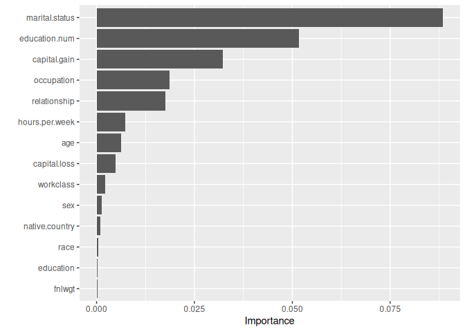
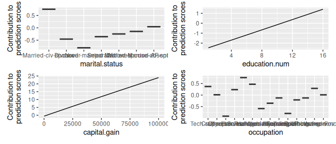
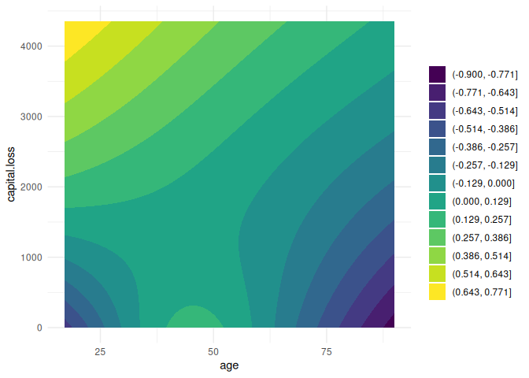
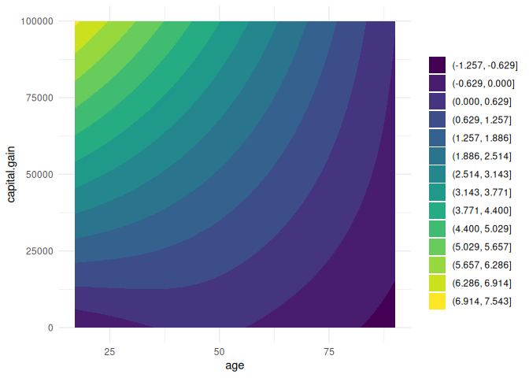
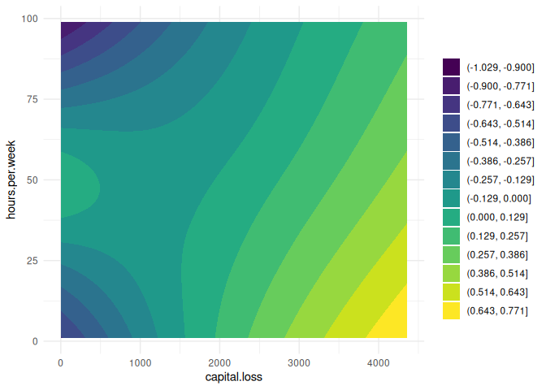
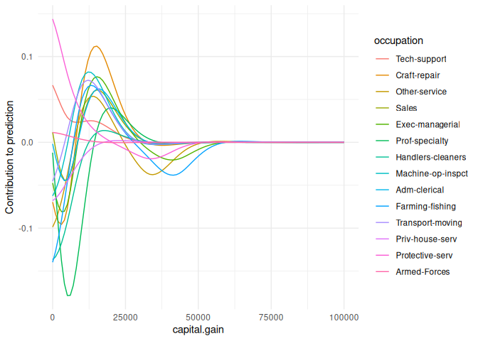
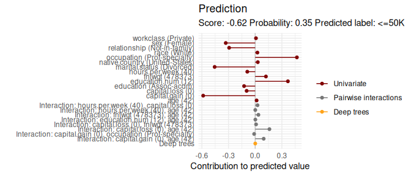

<!-- README.md is generated from README.Rmd. Please edit that file -->

# Autocompboost

### Use case

``` r
devtools::load_all()
#> ℹ Loading autocompboost

# Use adult task from OpenML:
task = tsk("oml", task_id = 7592)
#> INFO  [23:36:06.354] Retrieving JSON {url: `https://www.openml.org/api/v1/json/task/7592`, authenticated: `FALSE`}
#> INFO  [23:36:06.669] Retrieving JSON {url: `https://www.openml.org/api/v1/json/data/1590`, authenticated: `FALSE`}
#> INFO  [23:36:06.763] Retrieving ARFF {url: `https://api.openml.org/data/v1/download/1595261/adult.arff`, authenticated: `FALSE`}

# Remove rows with missings:
task$filter(which(complete.cases(task$data())))

# Train compboost learner:
set.seed(31415)
cboost = lrn("classif.compboost", predict_type = "prob", show_output = FALSE,
  learning_rate = 0.1, add_deeper_interactions = TRUE, use_components = FALSE,
  stop_epsylon_for_break = 0, stop_patience = 3L, df = 2,
  ncores = 4L)
cboost$train(task)
#> Number of groups in 'sex' is smaller than the degrees of freedom 4. Setting 'df = 2' for feature 'sex'.
#> Start risk: 0.378  test: 0.3681 
#> Tree 1: train risk: 0.378 test risk: 0.3681 time: 0 Min. patience: 0
#> Tree 2: train risk: 0.378 test risk: 0.3681 time: 0.01 Min. patience: 0
#> Tree 3: train risk: 0.378 test risk: 0.3681 time: 0.01 Min. patience: 0
#> Tree 4: train risk: 0.378 test risk: 0.3681 time: 0.02 Min. patience: 0
#> Tree 5: train risk: 0.378 test risk: 0.3681 time: 0.02 Min. patience: 0
#> Tree 6: train risk: 0.378 test risk: 0.3681 time: 0.03 Min. patience: 0
#> Tree 7: train risk: 0.378 test risk: 0.3681 time: 0.03 Min. patience: 0
#> Tree 8: train risk: 0.378 test risk: 0.3681 time: 0.04 Min. patience: 0
#> Tree 9: train risk: 0.378 test risk: 0.3681 time: 0.04 Min. patience: 0
#> Tree 10: train risk: 0.378 test risk: 0.3681 time: 0.05 Min. patience: 0
#> Tree 11: train risk: 0.378 test risk: 0.3681 time: 0.05 Min. patience: 0
#> Tree 12: train risk: 0.378 test risk: 0.3681 time: 0.05 Min. patience: 0
#> Tree 13: train risk: 0.378 test risk: 0.3681 time: 0.06 Min. patience: 0
#> Tree 14: train risk: 0.378 test risk: 0.3681 time: 0.06 Min. patience: 0
#> Tree 15: train risk: 0.378 test risk: 0.3681 time: 0.07 Min. patience: 0
#> Tree 16: train risk: 0.378 test risk: 0.3681 time: 0.07 Min. patience: 0
#> Tree 17: train risk: 0.378 test risk: 0.3681 time: 0.08 Min. patience: 0
#> Tree 18: train risk: 0.378 test risk: 0.3681 time: 0.08 Min. patience: 0
#> Tree 19: train risk: 0.378 test risk: 0.3681 time: 0.09 Min. patience: 0
#> Tree 20: train risk: 0.378 test risk: 0.3681 time: 0.09 Min. patience: 0
#> Tree 21: train risk: 0.378 test risk: 0.3681 time: 0.09 Min. patience: 0
#> Tree 22: train risk: 0.378 test risk: 0.3681 time: 0.1 Min. patience: 0
#> Tree 23: train risk: 0.378 test risk: 0.3681 time: 0.1 Min. patience: 0
#> Tree 24: train risk: 0.378 test risk: 0.3681 time: 0.11 Min. patience: 0
#> Tree 25: train risk: 0.378 test risk: 0.3681 time: 0.11 Min. patience: 0
#> Tree 26: train risk: 0.378 test risk: 0.3681 time: 0.11 Min. patience: 0
#> Tree 27: train risk: 0.378 test risk: 0.3681 time: 0.12 Min. patience: 0
#> Tree 28: train risk: 0.378 test risk: 0.3681 time: 0.12 Min. patience: 0
#> Tree 29: train risk: 0.378 test risk: 0.3681 time: 0.13 Min. patience: 0
#> Tree 30: train risk: 0.378 test risk: 0.3681 time: 0.13 Min. patience: 0
#> Tree 31: train risk: 0.378 test risk: 0.3681 time: 0.14 Min. patience: 0
#> Tree 32: train risk: 0.378 test risk: 0.3681 time: 0.14 Min. patience: 0
#> Tree 33: train risk: 0.378 test risk: 0.3681 time: 0.15 Min. patience: 0
#> Tree 34: train risk: 0.378 test risk: 0.3681 time: 0.15 Min. patience: 0
#> Tree 35: train risk: 0.378 test risk: 0.3681 time: 0.15 Min. patience: 0
#> Tree 36: train risk: 0.378 test risk: 0.3681 time: 0.16 Min. patience: 0
#> Tree 37: train risk: 0.378 test risk: 0.3681 time: 0.16 Min. patience: 0
#> Tree 38: train risk: 0.378 test risk: 0.3681 time: 0.17 Min. patience: 0
#> Tree 39: train risk: 0.378 test risk: 0.3681 time: 0.17 Min. patience: 0
#> Tree 40: train risk: 0.378 test risk: 0.3681 time: 0.17 Min. patience: 0
#> Tree 41: train risk: 0.378 test risk: 0.3681 time: 0.18 Min. patience: 0
#> Tree 42: train risk: 0.378 test risk: 0.3681 time: 0.19 Min. patience: 0
#> Tree 43: train risk: 0.378 test risk: 0.3681 time: 0.19 Min. patience: 0
#> Tree 44: train risk: 0.378 test risk: 0.3681 time: 0.19 Min. patience: 0
#> Tree 45: train risk: 0.378 test risk: 0.3681 time: 0.2 Min. patience: 0
#> Tree 46: train risk: 0.378 test risk: 0.3681 time: 0.2 Min. patience: 0
#> Tree 47: train risk: 0.378 test risk: 0.3681 time: 0.21 Min. patience: 0
#> Tree 48: train risk: 0.378 test risk: 0.3681 time: 0.21 Min. patience: 0
#> Tree 49: train risk: 0.378 test risk: 0.3681 time: 0.21 Min. patience: 0
#> Tree 50: train risk: 0.378 test risk: 0.3681 time: 0.22 Min. patience: 0
#> Tree 51: train risk: 0.378 test risk: 0.3681 time: 0.22 Min. patience: 0
#> Tree 52: train risk: 0.378 test risk: 0.3681 time: 0.23 Min. patience: 0
#> Tree 53: train risk: 0.378 test risk: 0.3681 time: 0.23 Min. patience: 0
#> Tree 54: train risk: 0.378 test risk: 0.3681 time: 0.23 Min. patience: 0
#> Tree 55: train risk: 0.378 test risk: 0.3681 time: 0.24 Min. patience: 0
#> Tree 56: train risk: 0.378 test risk: 0.3681 time: 0.24 Min. patience: 0
#> Tree 57: train risk: 0.378 test risk: 0.3681 time: 0.25 Min. patience: 0
#> Tree 58: train risk: 0.378 test risk: 0.3681 time: 0.25 Min. patience: 0
#> Tree 59: train risk: 0.378 test risk: 0.3681 time: 0.26 Min. patience: 0
#> Tree 60: train risk: 0.378 test risk: 0.3681 time: 0.26 Min. patience: 0
#> Tree 61: train risk: 0.378 test risk: 0.3681 time: 0.26 Min. patience: 0
#> Tree 62: train risk: 0.378 test risk: 0.3681 time: 0.27 Min. patience: 0
#> Tree 63: train risk: 0.378 test risk: 0.3681 time: 0.27 Min. patience: 0
#> Tree 64: train risk: 0.378 test risk: 0.3681 time: 0.28 Min. patience: 0
#> Tree 65: train risk: 0.378 test risk: 0.3681 time: 0.28 Min. patience: 0
#> Tree 66: train risk: 0.378 test risk: 0.3681 time: 0.29 Min. patience: 0
#> Tree 67: train risk: 0.378 test risk: 0.3681 time: 0.29 Min. patience: 0
#> Tree 68: train risk: 0.378 test risk: 0.3681 time: 0.29 Min. patience: 0
#> Tree 69: train risk: 0.378 test risk: 0.3681 time: 0.3 Min. patience: 0
#> Tree 70: train risk: 0.378 test risk: 0.3681 time: 0.3 Min. patience: 0
#> Tree 71: train risk: 0.378 test risk: 0.3681 time: 0.31 Min. patience: 0
#> Tree 72: train risk: 0.378 test risk: 0.3681 time: 0.31 Min. patience: 0
#> Tree 73: train risk: 0.378 test risk: 0.3681 time: 0.31 Min. patience: 0
#> Tree 74: train risk: 0.378 test risk: 0.3681 time: 0.32 Min. patience: 0
#> Tree 75: train risk: 0.378 test risk: 0.3681 time: 0.32 Min. patience: 0
#> Tree 76: train risk: 0.378 test risk: 0.3681 time: 0.33 Min. patience: 0
#> Tree 77: train risk: 0.378 test risk: 0.3681 time: 0.33 Min. patience: 0
#> Tree 78: train risk: 0.378 test risk: 0.3681 time: 0.33 Min. patience: 0
#> Tree 79: train risk: 0.378 test risk: 0.3681 time: 0.34 Min. patience: 0
#> Tree 80: train risk: 0.378 test risk: 0.3681 time: 0.34 Min. patience: 0
#> Tree 81: train risk: 0.378 test risk: 0.3681 time: 0.35 Min. patience: 0
#> Tree 82: train risk: 0.378 test risk: 0.3681 time: 0.35 Min. patience: 0
#> Tree 83: train risk: 0.378 test risk: 0.3681 time: 0.35 Min. patience: 0
#> Tree 84: train risk: 0.378 test risk: 0.3681 time: 0.36 Min. patience: 0
#> Tree 85: train risk: 0.378 test risk: 0.3681 time: 0.36 Min. patience: 0
#> Tree 86: train risk: 0.378 test risk: 0.3681 time: 0.37 Min. patience: 0
#> Tree 87: train risk: 0.378 test risk: 0.3681 time: 0.37 Min. patience: 0
#> Tree 88: train risk: 0.378 test risk: 0.3681 time: 0.38 Min. patience: 0
#> Tree 89: train risk: 0.378 test risk: 0.3681 time: 0.38 Min. patience: 0
#> Tree 90: train risk: 0.378 test risk: 0.3681 time: 0.38 Min. patience: 0
#> Tree 91: train risk: 0.378 test risk: 0.3681 time: 0.39 Min. patience: 0
#> Tree 92: train risk: 0.378 test risk: 0.3681 time: 0.39 Min. patience: 0
#> Tree 93: train risk: 0.378 test risk: 0.3681 time: 0.4 Min. patience: 0
#> Tree 94: train risk: 0.378 test risk: 0.3681 time: 0.4 Min. patience: 0
#> Tree 95: train risk: 0.378 test risk: 0.3681 time: 0.41 Min. patience: 0
#> Tree 96: train risk: 0.378 test risk: 0.3681 time: 0.41 Min. patience: 0
#> Tree 97: train risk: 0.378 test risk: 0.3681 time: 0.41 Min. patience: 0
#> Tree 98: train risk: 0.378 test risk: 0.3681 time: 0.42 Min. patience: 0
#> Tree 99: train risk: 0.378 test risk: 0.3681 time: 0.42 Min. patience: 0
#> Tree 100: train risk: 0.378 test risk: 0.3681 time: 0.43 Min. patience: 0
#> Tree 101: train risk: 0.378 test risk: 0.3681 time: 0.43 Min. patience: 0
#> Tree 102: train risk: 0.378 test risk: 0.3681 time: 0.43 Min. patience: 0
#> Tree 103: train risk: 0.378 test risk: 0.3681 time: 0.44 Min. patience: 0
#> Tree 104: train risk: 0.378 test risk: 0.3681 time: 0.44 Min. patience: 0
#> Tree 105: train risk: 0.378 test risk: 0.3681 time: 0.45 Min. patience: 0
#> Tree 106: train risk: 0.378 test risk: 0.3681 time: 0.45 Min. patience: 0
#> Tree 107: train risk: 0.378 test risk: 0.3681 time: 0.45 Min. patience: 0
#> Tree 108: train risk: 0.378 test risk: 0.3681 time: 0.46 Min. patience: 0
#> Tree 109: train risk: 0.378 test risk: 0.3681 time: 0.46 Min. patience: 0
#> Tree 110: train risk: 0.378 test risk: 0.3681 time: 0.47 Min. patience: 0
#> Tree 111: train risk: 0.378 test risk: 0.3681 time: 0.47 Min. patience: 0
#> Tree 112: train risk: 0.378 test risk: 0.3681 time: 0.48 Min. patience: 0
#> Tree 113: train risk: 0.378 test risk: 0.3681 time: 0.48 Min. patience: 0
#> Tree 114: train risk: 0.378 test risk: 0.3681 time: 0.48 Min. patience: 0
#> Tree 115: train risk: 0.378 test risk: 0.3681 time: 0.49 Min. patience: 0
#> Tree 116: train risk: 0.378 test risk: 0.3681 time: 0.49 Min. patience: 0
#> Tree 117: train risk: 0.378 test risk: 0.3681 time: 0.5 Min. patience: 0
#> Tree 118: train risk: 0.378 test risk: 0.3681 time: 0.5 Min. patience: 0
#> Tree 119: train risk: 0.378 test risk: 0.3681 time: 0.5 Min. patience: 0
#> Tree 120: train risk: 0.378 test risk: 0.3681 time: 0.51 Min. patience: 0
#> Tree 121: train risk: 0.378 test risk: 0.3681 time: 0.51 Min. patience: 0
#> Tree 122: train risk: 0.378 test risk: 0.3681 time: 0.52 Min. patience: 0
#> Tree 123: train risk: 0.378 test risk: 0.3681 time: 0.52 Min. patience: 0
#> Tree 124: train risk: 0.378 test risk: 0.3681 time: 0.52 Min. patience: 0
#> Tree 125: train risk: 0.378 test risk: 0.3681 time: 0.53 Min. patience: 0
#> Tree 126: train risk: 0.378 test risk: 0.3681 time: 0.53 Min. patience: 0
#> Tree 127: train risk: 0.378 test risk: 0.3681 time: 0.54 Min. patience: 0
#> Tree 128: train risk: 0.378 test risk: 0.3681 time: 0.54 Min. patience: 0
#> Tree 129: train risk: 0.378 test risk: 0.3681 time: 0.54 Min. patience: 0
#> Tree 130: train risk: 0.378 test risk: 0.3681 time: 0.55 Min. patience: 0
#> Tree 131: train risk: 0.378 test risk: 0.3681 time: 0.55 Min. patience: 0
#> Tree 132: train risk: 0.378 test risk: 0.3681 time: 0.56 Min. patience: 0
#> Tree 133: train risk: 0.378 test risk: 0.3681 time: 0.56 Min. patience: 0
#> Tree 134: train risk: 0.378 test risk: 0.3681 time: 0.57 Min. patience: 0
#> Tree 135: train risk: 0.378 test risk: 0.3681 time: 0.57 Min. patience: 0
#> Tree 136: train risk: 0.378 test risk: 0.3681 time: 0.58 Min. patience: 0
#> Tree 137: train risk: 0.378 test risk: 0.3681 time: 0.58 Min. patience: 0
#> Tree 138: train risk: 0.378 test risk: 0.3681 time: 0.58 Min. patience: 0
#> Tree 139: train risk: 0.378 test risk: 0.3681 time: 0.59 Min. patience: 0
#> Tree 140: train risk: 0.378 test risk: 0.3681 time: 0.59 Min. patience: 0
#> Tree 141: train risk: 0.378 test risk: 0.3681 time: 0.6 Min. patience: 0
#> Tree 142: train risk: 0.378 test risk: 0.3681 time: 0.6 Min. patience: 0
#> Tree 143: train risk: 0.378 test risk: 0.3681 time: 0.6 Min. patience: 0
#> Tree 144: train risk: 0.378 test risk: 0.3681 time: 0.61 Min. patience: 0
#> Tree 145: train risk: 0.378 test risk: 0.3681 time: 0.61 Min. patience: 0
#> Tree 146: train risk: 0.378 test risk: 0.3681 time: 0.62 Min. patience: 0
#> Tree 147: train risk: 0.378 test risk: 0.3681 time: 0.62 Min. patience: 0
#> Tree 148: train risk: 0.378 test risk: 0.3681 time: 0.62 Min. patience: 0
#> Tree 149: train risk: 0.378 test risk: 0.3681 time: 0.63 Min. patience: 0
#> Tree 150: train risk: 0.378 test risk: 0.3681 time: 0.63 Min. patience: 0
#> Tree 151: train risk: 0.378 test risk: 0.3681 time: 0.64 Min. patience: 0
#> Tree 152: train risk: 0.378 test risk: 0.3681 time: 0.64 Min. patience: 0
#> Tree 153: train risk: 0.378 test risk: 0.3681 time: 0.65 Min. patience: 0
#> Tree 154: train risk: 0.378 test risk: 0.3681 time: 0.65 Min. patience: 0
#> Tree 155: train risk: 0.378 test risk: 0.3681 time: 0.66 Min. patience: 0
#> Tree 156: train risk: 0.378 test risk: 0.3681 time: 0.66 Min. patience: 0
#> Tree 157: train risk: 0.378 test risk: 0.3681 time: 0.66 Min. patience: 0
#> Tree 158: train risk: 0.378 test risk: 0.3681 time: 0.67 Min. patience: 0
#> Tree 159: train risk: 0.378 test risk: 0.3681 time: 0.67 Min. patience: 0
#> Tree 160: train risk: 0.378 test risk: 0.3681 time: 0.68 Min. patience: 0
#> Tree 161: train risk: 0.378 test risk: 0.3681 time: 0.68 Min. patience: 0
#> Tree 162: train risk: 0.378 test risk: 0.3681 time: 0.68 Min. patience: 0
#> Tree 163: train risk: 0.378 test risk: 0.3681 time: 0.69 Min. patience: 0
#> Tree 164: train risk: 0.378 test risk: 0.3681 time: 0.69 Min. patience: 0
#> Tree 165: train risk: 0.378 test risk: 0.3681 time: 0.7 Min. patience: 0
#> Tree 166: train risk: 0.378 test risk: 0.3681 time: 0.7 Min. patience: 0
#> Tree 167: train risk: 0.378 test risk: 0.3681 time: 0.71 Min. patience: 0
#> Tree 168: train risk: 0.378 test risk: 0.3681 time: 0.71 Min. patience: 0
#> Tree 169: train risk: 0.378 test risk: 0.3681 time: 0.71 Min. patience: 0
#> Tree 170: train risk: 0.378 test risk: 0.3681 time: 0.72 Min. patience: 0
#> Tree 171: train risk: 0.378 test risk: 0.3681 time: 0.72 Min. patience: 0
#> Tree 172: train risk: 0.378 test risk: 0.3681 time: 0.73 Min. patience: 0
#> Tree 173: train risk: 0.378 test risk: 0.3681 time: 0.73 Min. patience: 0
#> Tree 174: train risk: 0.378 test risk: 0.3681 time: 0.73 Min. patience: 0
#> Tree 175: train risk: 0.378 test risk: 0.3681 time: 0.74 Min. patience: 0
#> Tree 176: train risk: 0.378 test risk: 0.3681 time: 0.74 Min. patience: 0
#> Tree 177: train risk: 0.378 test risk: 0.3681 time: 0.75 Min. patience: 0
#> Tree 178: train risk: 0.378 test risk: 0.3681 time: 0.75 Min. patience: 0
#> Tree 179: train risk: 0.378 test risk: 0.3681 time: 0.75 Min. patience: 0
#> Tree 180: train risk: 0.378 test risk: 0.3681 time: 0.76 Min. patience: 0
#> Tree 181: train risk: 0.378 test risk: 0.3681 time: 0.76 Min. patience: 0
#> Tree 182: train risk: 0.378 test risk: 0.3681 time: 0.77 Min. patience: 0
#> Tree 183: train risk: 0.378 test risk: 0.3681 time: 0.77 Min. patience: 0
#> Tree 184: train risk: 0.378 test risk: 0.3681 time: 0.77 Min. patience: 0
#> Tree 185: train risk: 0.378 test risk: 0.3681 time: 0.78 Min. patience: 0
#> Tree 186: train risk: 0.378 test risk: 0.3681 time: 0.78 Min. patience: 0
#> Tree 187: train risk: 0.378 test risk: 0.3681 time: 0.79 Min. patience: 0
#> Tree 188: train risk: 0.378 test risk: 0.3681 time: 0.79 Min. patience: 0
#> Tree 189: train risk: 0.378 test risk: 0.3681 time: 0.8 Min. patience: 0
#> Tree 190: train risk: 0.378 test risk: 0.3681 time: 0.8 Min. patience: 0
#> Tree 191: train risk: 0.378 test risk: 0.3681 time: 0.8 Min. patience: 0
#> Tree 192: train risk: 0.378 test risk: 0.3681 time: 0.81 Min. patience: 0
#> Tree 193: train risk: 0.378 test risk: 0.3681 time: 0.81 Min. patience: 0
#> Tree 194: train risk: 0.378 test risk: 0.3681 time: 0.82 Min. patience: 0
#> Tree 195: train risk: 0.378 test risk: 0.3681 time: 0.82 Min. patience: 0
#> Tree 196: train risk: 0.378 test risk: 0.3681 time: 0.82 Min. patience: 0
#> Tree 197: train risk: 0.378 test risk: 0.3681 time: 0.83 Min. patience: 0
#> Tree 198: train risk: 0.378 test risk: 0.3681 time: 0.83 Min. patience: 0
#> Tree 199: train risk: 0.378 test risk: 0.3681 time: 0.84 Min. patience: 0
#> Tree 200: train risk: 0.378 test risk: 0.3681 time: 0.84 Min. patience: 0
#> Tree 201: train risk: 0.378 test risk: 0.3681 time: 0.84 Min. patience: 0
#> Tree 202: train risk: 0.378 test risk: 0.3681 time: 0.85 Min. patience: 0
#> Tree 203: train risk: 0.378 test risk: 0.3681 time: 0.85 Min. patience: 0
#> Tree 204: train risk: 0.378 test risk: 0.3681 time: 0.86 Min. patience: 0
#> Tree 205: train risk: 0.378 test risk: 0.3681 time: 0.86 Min. patience: 0
#> Tree 206: train risk: 0.378 test risk: 0.3681 time: 0.86 Min. patience: 0
#> Tree 207: train risk: 0.378 test risk: 0.3681 time: 0.87 Min. patience: 0
#> Tree 208: train risk: 0.378 test risk: 0.3681 time: 0.87 Min. patience: 0
#> Tree 209: train risk: 0.378 test risk: 0.3681 time: 0.88 Min. patience: 0
#> Tree 210: train risk: 0.378 test risk: 0.3681 time: 0.88 Min. patience: 0
#> Tree 211: train risk: 0.378 test risk: 0.3681 time: 0.88 Min. patience: 0
#> Tree 212: train risk: 0.378 test risk: 0.3681 time: 0.89 Min. patience: 0
#> Tree 213: train risk: 0.378 test risk: 0.3681 time: 0.89 Min. patience: 0
#> Tree 214: train risk: 0.378 test risk: 0.3681 time: 0.9 Min. patience: 0
#> Tree 215: train risk: 0.378 test risk: 0.3681 time: 0.9 Min. patience: 0
#> Tree 216: train risk: 0.378 test risk: 0.3681 time: 0.91 Min. patience: 0
#> Tree 217: train risk: 0.378 test risk: 0.3681 time: 0.91 Min. patience: 0
#> Tree 218: train risk: 0.378 test risk: 0.3681 time: 0.91 Min. patience: 0
#> Tree 219: train risk: 0.378 test risk: 0.3681 time: 0.92 Min. patience: 0
#> Tree 220: train risk: 0.378 test risk: 0.3681 time: 0.92 Min. patience: 0
#> Tree 221: train risk: 0.378 test risk: 0.3681 time: 0.93 Min. patience: 0
#> Tree 222: train risk: 0.378 test risk: 0.3681 time: 0.93 Min. patience: 0
#> Tree 223: train risk: 0.378 test risk: 0.3681 time: 0.93 Min. patience: 0
#> Tree 224: train risk: 0.378 test risk: 0.3681 time: 0.94 Min. patience: 0
#> Tree 225: train risk: 0.378 test risk: 0.3681 time: 0.94 Min. patience: 0
#> Tree 226: train risk: 0.378 test risk: 0.3681 time: 0.95 Min. patience: 0
#> Tree 227: train risk: 0.378 test risk: 0.3681 time: 0.95 Min. patience: 0
#> Tree 228: train risk: 0.378 test risk: 0.3681 time: 0.95 Min. patience: 0
#> Tree 229: train risk: 0.378 test risk: 0.3681 time: 0.96 Min. patience: 0
#> Tree 230: train risk: 0.378 test risk: 0.3681 time: 0.96 Min. patience: 0
#> Tree 231: train risk: 0.378 test risk: 0.3681 time: 0.97 Min. patience: 0
#> Tree 232: train risk: 0.378 test risk: 0.3681 time: 0.97 Min. patience: 0
#> Tree 233: train risk: 0.378 test risk: 0.3681 time: 0.97 Min. patience: 0
#> Tree 234: train risk: 0.378 test risk: 0.3681 time: 0.98 Min. patience: 0
#> Tree 235: train risk: 0.378 test risk: 0.3681 time: 0.98 Min. patience: 0
#> Tree 236: train risk: 0.378 test risk: 0.3681 time: 0.99 Min. patience: 0
#> Tree 237: train risk: 0.378 test risk: 0.3681 time: 0.99 Min. patience: 0
#> Tree 238: train risk: 0.378 test risk: 0.3681 time: 0.99 Min. patience: 0
#> Tree 239: train risk: 0.378 test risk: 0.3681 time: 1 Min. patience: 0
#> Tree 240: train risk: 0.378 test risk: 0.3681 time: 1.01 Min. patience: 0
#> Tree 241: train risk: 0.378 test risk: 0.3681 time: 1.01 Min. patience: 0
#> Tree 242: train risk: 0.378 test risk: 0.3681 time: 1.01 Min. patience: 0
#> Tree 243: train risk: 0.378 test risk: 0.3681 time: 1.02 Min. patience: 0
#> Tree 244: train risk: 0.378 test risk: 0.3681 time: 1.02 Min. patience: 0
#> Tree 245: train risk: 0.378 test risk: 0.3681 time: 1.03 Min. patience: 0
#> Tree 246: train risk: 0.378 test risk: 0.3681 time: 1.03 Min. patience: 0
#> Tree 247: train risk: 0.378 test risk: 0.3681 time: 1.03 Min. patience: 0
#> Tree 248: train risk: 0.378 test risk: 0.3681 time: 1.04 Min. patience: 0
#> Tree 249: train risk: 0.378 test risk: 0.3681 time: 1.04 Min. patience: 0
#> Tree 250: train risk: 0.378 test risk: 0.3681 time: 1.05 Min. patience: 0
#> Tree 251: train risk: 0.378 test risk: 0.3681 time: 1.05 Min. patience: 0
#> Tree 252: train risk: 0.378 test risk: 0.3681 time: 1.05 Min. patience: 0
#> Tree 253: train risk: 0.378 test risk: 0.3681 time: 1.06 Min. patience: 0
#> Tree 254: train risk: 0.378 test risk: 0.3681 time: 1.06 Min. patience: 0
#> Tree 255: train risk: 0.378 test risk: 0.3681 time: 1.07 Min. patience: 0
#> Tree 256: train risk: 0.378 test risk: 0.3681 time: 1.07 Min. patience: 0
#> Tree 257: train risk: 0.378 test risk: 0.3681 time: 1.08 Min. patience: 0
#> Tree 258: train risk: 0.378 test risk: 0.3681 time: 1.08 Min. patience: 0
#> Tree 259: train risk: 0.378 test risk: 0.3681 time: 1.08 Min. patience: 0
#> Tree 260: train risk: 0.378 test risk: 0.3681 time: 1.09 Min. patience: 0
#> Tree 261: train risk: 0.378 test risk: 0.3681 time: 1.09 Min. patience: 0
#> Tree 262: train risk: 0.378 test risk: 0.3681 time: 1.1 Min. patience: 0
#> Tree 263: train risk: 0.378 test risk: 0.3681 time: 1.1 Min. patience: 0
#> Tree 264: train risk: 0.378 test risk: 0.3681 time: 1.1 Min. patience: 0
#> Tree 265: train risk: 0.378 test risk: 0.3681 time: 1.11 Min. patience: 0
#> Tree 266: train risk: 0.378 test risk: 0.3681 time: 1.11 Min. patience: 0
#> Tree 267: train risk: 0.378 test risk: 0.3681 time: 1.12 Min. patience: 0
#> Tree 268: train risk: 0.378 test risk: 0.3681 time: 1.12 Min. patience: 0
#> Tree 269: train risk: 0.378 test risk: 0.3681 time: 1.12 Min. patience: 0
#> Tree 270: train risk: 0.378 test risk: 0.3681 time: 1.13 Min. patience: 0
#> Tree 271: train risk: 0.378 test risk: 0.3681 time: 1.13 Min. patience: 0
#> Tree 272: train risk: 0.378 test risk: 0.3681 time: 1.14 Min. patience: 0
#> Tree 273: train risk: 0.378 test risk: 0.3681 time: 1.14 Min. patience: 0
#> Tree 274: train risk: 0.378 test risk: 0.3681 time: 1.14 Min. patience: 0
#> Tree 275: train risk: 0.378 test risk: 0.3681 time: 1.15 Min. patience: 0
#> Tree 276: train risk: 0.378 test risk: 0.3681 time: 1.15 Min. patience: 0
#> Tree 277: train risk: 0.378 test risk: 0.3681 time: 1.16 Min. patience: 0
#> Tree 278: train risk: 0.378 test risk: 0.3681 time: 1.16 Min. patience: 0
#> Tree 279: train risk: 0.378 test risk: 0.3681 time: 1.16 Min. patience: 0
#> Tree 280: train risk: 0.378 test risk: 0.3681 time: 1.17 Min. patience: 0
#> Tree 281: train risk: 0.378 test risk: 0.3681 time: 1.17 Min. patience: 0
#> Tree 282: train risk: 0.378 test risk: 0.3681 time: 1.18 Min. patience: 0
#> Tree 283: train risk: 0.378 test risk: 0.3681 time: 1.18 Min. patience: 0
#> Tree 284: train risk: 0.378 test risk: 0.3681 time: 1.18 Min. patience: 0
#> Tree 285: train risk: 0.378 test risk: 0.3681 time: 1.19 Min. patience: 0
#> Tree 286: train risk: 0.378 test risk: 0.3681 time: 1.19 Min. patience: 0
#> Tree 287: train risk: 0.378 test risk: 0.3681 time: 1.2 Min. patience: 0
#> Tree 288: train risk: 0.378 test risk: 0.3681 time: 1.2 Min. patience: 0
#> Tree 289: train risk: 0.378 test risk: 0.3681 time: 1.2 Min. patience: 0
#> Tree 290: train risk: 0.378 test risk: 0.3681 time: 1.21 Min. patience: 0
#> Tree 291: train risk: 0.378 test risk: 0.3681 time: 1.21 Min. patience: 0
#> Tree 292: train risk: 0.378 test risk: 0.3681 time: 1.22 Min. patience: 0
#> Tree 293: train risk: 0.378 test risk: 0.3681 time: 1.22 Min. patience: 0
#> Tree 294: train risk: 0.378 test risk: 0.3681 time: 1.23 Min. patience: 0
#> Tree 295: train risk: 0.378 test risk: 0.3681 time: 1.23 Min. patience: 0
#> Tree 296: train risk: 0.378 test risk: 0.3681 time: 1.23 Min. patience: 0
#> Tree 297: train risk: 0.378 test risk: 0.3681 time: 1.24 Min. patience: 0
#> Tree 298: train risk: 0.378 test risk: 0.3681 time: 1.24 Min. patience: 0
#> Tree 299: train risk: 0.378 test risk: 0.3681 time: 1.25 Min. patience: 0
#> Tree 300: train risk: 0.378 test risk: 0.3681 time: 1.25 Min. patience: 0
#> Tree 301: train risk: 0.378 test risk: 0.3681 time: 1.25 Min. patience: 0
#> Tree 302: train risk: 0.378 test risk: 0.3681 time: 1.26 Min. patience: 0
#> Tree 303: train risk: 0.378 test risk: 0.3681 time: 1.26 Min. patience: 0
#> Tree 304: train risk: 0.378 test risk: 0.3681 time: 1.27 Min. patience: 0
#> Tree 305: train risk: 0.378 test risk: 0.3681 time: 1.27 Min. patience: 0
#> Tree 306: train risk: 0.378 test risk: 0.3681 time: 1.27 Min. patience: 0
#> Tree 307: train risk: 0.378 test risk: 0.3681 time: 1.28 Min. patience: 0
#> Tree 308: train risk: 0.378 test risk: 0.3681 time: 1.28 Min. patience: 0
#> Tree 309: train risk: 0.378 test risk: 0.3681 time: 1.29 Min. patience: 0
#> Tree 310: train risk: 0.378 test risk: 0.3681 time: 1.29 Min. patience: 0
#> Tree 311: train risk: 0.378 test risk: 0.3681 time: 1.29 Min. patience: 0
#> Tree 312: train risk: 0.378 test risk: 0.3681 time: 1.3 Min. patience: 0
#> Tree 313: train risk: 0.378 test risk: 0.3681 time: 1.3 Min. patience: 0
#> Tree 314: train risk: 0.378 test risk: 0.3681 time: 1.31 Min. patience: 0
#> Tree 315: train risk: 0.378 test risk: 0.3681 time: 1.31 Min. patience: 0
#> Tree 316: train risk: 0.378 test risk: 0.3681 time: 1.32 Min. patience: 0
#> Tree 317: train risk: 0.378 test risk: 0.3681 time: 1.32 Min. patience: 0
#> Tree 318: train risk: 0.378 test risk: 0.3681 time: 1.32 Min. patience: 0
#> Tree 319: train risk: 0.378 test risk: 0.3681 time: 1.33 Min. patience: 0
#> Tree 320: train risk: 0.378 test risk: 0.3681 time: 1.33 Min. patience: 0
#> Tree 321: train risk: 0.378 test risk: 0.3681 time: 1.34 Min. patience: 0
#> Tree 322: train risk: 0.378 test risk: 0.3681 time: 1.34 Min. patience: 0
#> Tree 323: train risk: 0.378 test risk: 0.3681 time: 1.34 Min. patience: 0
#> Tree 324: train risk: 0.378 test risk: 0.3681 time: 1.35 Min. patience: 0
#> Tree 325: train risk: 0.378 test risk: 0.3681 time: 1.35 Min. patience: 0
#> Tree 326: train risk: 0.378 test risk: 0.3681 time: 1.36 Min. patience: 0
#> Tree 327: train risk: 0.378 test risk: 0.3681 time: 1.36 Min. patience: 0
#> Tree 328: train risk: 0.378 test risk: 0.3681 time: 1.37 Min. patience: 0
#> Tree 329: train risk: 0.378 test risk: 0.3681 time: 1.37 Min. patience: 0
#> Tree 330: train risk: 0.378 test risk: 0.3681 time: 1.37 Min. patience: 0
#> Tree 331: train risk: 0.378 test risk: 0.3681 time: 1.38 Min. patience: 0
#> Tree 332: train risk: 0.378 test risk: 0.3681 time: 1.38 Min. patience: 0
#> Tree 333: train risk: 0.378 test risk: 0.3681 time: 1.39 Min. patience: 0
#> Tree 334: train risk: 0.378 test risk: 0.3681 time: 1.39 Min. patience: 0
#> Tree 335: train risk: 0.378 test risk: 0.3681 time: 1.39 Min. patience: 0
#> Tree 336: train risk: 0.378 test risk: 0.3681 time: 1.4 Min. patience: 0
#> Tree 337: train risk: 0.378 test risk: 0.3681 time: 1.4 Min. patience: 0
#> Tree 338: train risk: 0.378 test risk: 0.3681 time: 1.41 Min. patience: 0
#> Tree 339: train risk: 0.378 test risk: 0.3681 time: 1.41 Min. patience: 0
#> Tree 340: train risk: 0.378 test risk: 0.3681 time: 1.41 Min. patience: 0
#> Tree 341: train risk: 0.378 test risk: 0.3681 time: 1.42 Min. patience: 0
#> Tree 342: train risk: 0.378 test risk: 0.3681 time: 1.42 Min. patience: 0
#> Tree 343: train risk: 0.378 test risk: 0.3681 time: 1.43 Min. patience: 0
#> Tree 344: train risk: 0.378 test risk: 0.3681 time: 1.43 Min. patience: 0
#> Tree 345: train risk: 0.378 test risk: 0.3681 time: 1.43 Min. patience: 0
#> Tree 346: train risk: 0.378 test risk: 0.3681 time: 1.44 Min. patience: 0
#> Tree 347: train risk: 0.378 test risk: 0.3681 time: 1.44 Min. patience: 0
#> Tree 348: train risk: 0.378 test risk: 0.3681 time: 1.45 Min. patience: 0
#> Tree 349: train risk: 0.378 test risk: 0.3681 time: 1.45 Min. patience: 0
#> Tree 350: train risk: 0.378 test risk: 0.3681 time: 1.45 Min. patience: 0
#> Tree 351: train risk: 0.378 test risk: 0.3681 time: 1.46 Min. patience: 0
#> Tree 352: train risk: 0.378 test risk: 0.3681 time: 1.46 Min. patience: 0
#> Tree 353: train risk: 0.378 test risk: 0.3681 time: 1.46 Min. patience: 0
#> Tree 354: train risk: 0.378 test risk: 0.3681 time: 1.47 Min. patience: 0
#> Tree 355: train risk: 0.378 test risk: 0.3681 time: 1.47 Min. patience: 0
#> Tree 356: train risk: 0.378 test risk: 0.3681 time: 1.48 Min. patience: 0
#> Tree 357: train risk: 0.378 test risk: 0.3681 time: 1.48 Min. patience: 0
#> Tree 358: train risk: 0.378 test risk: 0.3681 time: 1.48 Min. patience: 0
#> Tree 359: train risk: 0.378 test risk: 0.3681 time: 1.49 Min. patience: 0
#> Tree 360: train risk: 0.378 test risk: 0.3681 time: 1.49 Min. patience: 0
#> Tree 361: train risk: 0.378 test risk: 0.3681 time: 1.5 Min. patience: 0
#> Tree 362: train risk: 0.378 test risk: 0.3681 time: 1.5 Min. patience: 0
#> Tree 363: train risk: 0.378 test risk: 0.3681 time: 1.5 Min. patience: 0
#> Tree 364: train risk: 0.378 test risk: 0.3681 time: 1.51 Min. patience: 0
#> Tree 365: train risk: 0.378 test risk: 0.3681 time: 1.51 Min. patience: 0
#> Tree 366: train risk: 0.378 test risk: 0.3681 time: 1.52 Min. patience: 0
#> Tree 367: train risk: 0.378 test risk: 0.3681 time: 1.52 Min. patience: 0
#> Tree 368: train risk: 0.378 test risk: 0.3681 time: 1.52 Min. patience: 0
#> Tree 369: train risk: 0.378 test risk: 0.3681 time: 1.53 Min. patience: 0
#> Tree 370: train risk: 0.378 test risk: 0.3681 time: 1.53 Min. patience: 0
#> Tree 371: train risk: 0.378 test risk: 0.3681 time: 1.54 Min. patience: 0
#> Tree 372: train risk: 0.378 test risk: 0.3681 time: 1.54 Min. patience: 0
#> Tree 373: train risk: 0.378 test risk: 0.3681 time: 1.54 Min. patience: 0
#> Tree 374: train risk: 0.378 test risk: 0.3681 time: 1.55 Min. patience: 0
#> Tree 375: train risk: 0.378 test risk: 0.3681 time: 1.55 Min. patience: 0
#> Tree 376: train risk: 0.378 test risk: 0.3681 time: 1.56 Min. patience: 0
#> Tree 377: train risk: 0.378 test risk: 0.3681 time: 1.56 Min. patience: 0
#> Tree 378: train risk: 0.378 test risk: 0.3681 time: 1.56 Min. patience: 0
#> Tree 379: train risk: 0.378 test risk: 0.3681 time: 1.57 Min. patience: 0
#> Tree 380: train risk: 0.378 test risk: 0.3681 time: 1.57 Min. patience: 0
#> Tree 381: train risk: 0.378 test risk: 0.3681 time: 1.58 Min. patience: 0
#> Tree 382: train risk: 0.378 test risk: 0.3681 time: 1.58 Min. patience: 0
#> Tree 383: train risk: 0.378 test risk: 0.3681 time: 1.58 Min. patience: 0
#> Tree 384: train risk: 0.378 test risk: 0.3681 time: 1.59 Min. patience: 0
#> Tree 385: train risk: 0.378 test risk: 0.3681 time: 1.59 Min. patience: 0
#> Tree 386: train risk: 0.378 test risk: 0.3681 time: 1.6 Min. patience: 0
#> Tree 387: train risk: 0.378 test risk: 0.3681 time: 1.6 Min. patience: 0
#> Tree 388: train risk: 0.378 test risk: 0.3681 time: 1.6 Min. patience: 0
#> Tree 389: train risk: 0.378 test risk: 0.3681 time: 1.61 Min. patience: 0
#> Tree 390: train risk: 0.378 test risk: 0.3681 time: 1.61 Min. patience: 0
#> Tree 391: train risk: 0.378 test risk: 0.3681 time: 1.62 Min. patience: 0
#> Tree 392: train risk: 0.378 test risk: 0.3681 time: 1.62 Min. patience: 0
#> Tree 393: train risk: 0.378 test risk: 0.3681 time: 1.62 Min. patience: 0
#> Tree 394: train risk: 0.378 test risk: 0.3681 time: 1.63 Min. patience: 0
#> Tree 395: train risk: 0.378 test risk: 0.3681 time: 1.63 Min. patience: 0
#> Tree 396: train risk: 0.378 test risk: 0.3681 time: 1.64 Min. patience: 0
#> Tree 397: train risk: 0.378 test risk: 0.3681 time: 1.64 Min. patience: 0
#> Tree 398: train risk: 0.378 test risk: 0.3681 time: 1.65 Min. patience: 0
#> Tree 399: train risk: 0.378 test risk: 0.3681 time: 1.65 Min. patience: 0
#> Tree 400: train risk: 0.378 test risk: 0.3681 time: 1.66 Min. patience: 0
#> Tree 401: train risk: 0.378 test risk: 0.3681 time: 1.66 Min. patience: 0
#> Tree 402: train risk: 0.378 test risk: 0.3681 time: 1.66 Min. patience: 0
#> Tree 403: train risk: 0.378 test risk: 0.3681 time: 1.67 Min. patience: 0
#> Tree 404: train risk: 0.378 test risk: 0.3681 time: 1.67 Min. patience: 0
#> Tree 405: train risk: 0.378 test risk: 0.3681 time: 1.68 Min. patience: 0
#> Tree 406: train risk: 0.378 test risk: 0.3681 time: 1.68 Min. patience: 0
#> Tree 407: train risk: 0.378 test risk: 0.3681 time: 1.68 Min. patience: 0
#> Tree 408: train risk: 0.378 test risk: 0.3681 time: 1.69 Min. patience: 0
#> Tree 409: train risk: 0.378 test risk: 0.3681 time: 1.69 Min. patience: 0
#> Tree 410: train risk: 0.378 test risk: 0.3681 time: 1.7 Min. patience: 0
#> Tree 411: train risk: 0.378 test risk: 0.3681 time: 1.7 Min. patience: 0
#> Tree 412: train risk: 0.378 test risk: 0.3681 time: 1.71 Min. patience: 0
#> Tree 413: train risk: 0.378 test risk: 0.3681 time: 1.71 Min. patience: 0
#> Tree 414: train risk: 0.378 test risk: 0.3681 time: 1.71 Min. patience: 0
#> Tree 415: train risk: 0.378 test risk: 0.3681 time: 1.72 Min. patience: 0
#> Tree 416: train risk: 0.378 test risk: 0.3681 time: 1.72 Min. patience: 0
#> Tree 417: train risk: 0.378 test risk: 0.3681 time: 1.73 Min. patience: 0
#> Tree 418: train risk: 0.378 test risk: 0.3681 time: 1.73 Min. patience: 0
#> Tree 419: train risk: 0.378 test risk: 0.3681 time: 1.74 Min. patience: 0
#> Tree 420: train risk: 0.378 test risk: 0.3681 time: 1.74 Min. patience: 0
#> Tree 421: train risk: 0.378 test risk: 0.3681 time: 1.74 Min. patience: 0
#> Tree 422: train risk: 0.378 test risk: 0.3681 time: 1.75 Min. patience: 0
#> Tree 423: train risk: 0.378 test risk: 0.3681 time: 1.75 Min. patience: 0
#> Tree 424: train risk: 0.378 test risk: 0.3681 time: 1.76 Min. patience: 0
#> Tree 425: train risk: 0.378 test risk: 0.3681 time: 1.76 Min. patience: 0
#> Tree 426: train risk: 0.378 test risk: 0.3681 time: 1.76 Min. patience: 0
#> Tree 427: train risk: 0.378 test risk: 0.3681 time: 1.77 Min. patience: 0
#> Tree 428: train risk: 0.378 test risk: 0.3681 time: 1.77 Min. patience: 0
#> Tree 429: train risk: 0.378 test risk: 0.3681 time: 1.78 Min. patience: 0
#> Tree 430: train risk: 0.378 test risk: 0.3681 time: 1.78 Min. patience: 0
#> Tree 431: train risk: 0.378 test risk: 0.3681 time: 1.78 Min. patience: 0
#> Tree 432: train risk: 0.378 test risk: 0.3681 time: 1.79 Min. patience: 0
#> Tree 433: train risk: 0.378 test risk: 0.3681 time: 1.79 Min. patience: 0
#> Tree 434: train risk: 0.378 test risk: 0.3681 time: 1.79 Min. patience: 0
#> Tree 435: train risk: 0.378 test risk: 0.3681 time: 1.8 Min. patience: 0
#> Tree 436: train risk: 0.378 test risk: 0.3681 time: 1.8 Min. patience: 0
#> Tree 437: train risk: 0.378 test risk: 0.3681 time: 1.81 Min. patience: 0
#> Tree 438: train risk: 0.378 test risk: 0.3681 time: 1.81 Min. patience: 0
#> Tree 439: train risk: 0.378 test risk: 0.3681 time: 1.81 Min. patience: 0
#> Tree 440: train risk: 0.378 test risk: 0.3681 time: 1.82 Min. patience: 0
#> Tree 441: train risk: 0.378 test risk: 0.3681 time: 1.82 Min. patience: 0
#> Tree 442: train risk: 0.378 test risk: 0.3681 time: 1.83 Min. patience: 0
#> Tree 443: train risk: 0.378 test risk: 0.3681 time: 1.83 Min. patience: 0
#> Tree 444: train risk: 0.378 test risk: 0.3681 time: 1.83 Min. patience: 0
#> Tree 445: train risk: 0.378 test risk: 0.3681 time: 1.84 Min. patience: 0
#> Tree 446: train risk: 0.378 test risk: 0.3681 time: 1.84 Min. patience: 0
#> Tree 447: train risk: 0.378 test risk: 0.3681 time: 1.85 Min. patience: 0
#> Tree 448: train risk: 0.378 test risk: 0.3681 time: 1.85 Min. patience: 0
#> Tree 449: train risk: 0.378 test risk: 0.3681 time: 1.85 Min. patience: 0
#> Tree 450: train risk: 0.378 test risk: 0.3681 time: 1.86 Min. patience: 0
#> Tree 451: train risk: 0.378 test risk: 0.3681 time: 1.86 Min. patience: 0
#> Tree 452: train risk: 0.378 test risk: 0.3681 time: 1.87 Min. patience: 0
#> Tree 453: train risk: 0.378 test risk: 0.3681 time: 1.87 Min. patience: 0
#> Tree 454: train risk: 0.378 test risk: 0.3681 time: 1.87 Min. patience: 0
#> Tree 455: train risk: 0.378 test risk: 0.3681 time: 1.88 Min. patience: 0
#> Tree 456: train risk: 0.378 test risk: 0.3681 time: 1.88 Min. patience: 0
#> Tree 457: train risk: 0.378 test risk: 0.3681 time: 1.89 Min. patience: 0
#> Tree 458: train risk: 0.378 test risk: 0.3681 time: 1.89 Min. patience: 0
#> Tree 459: train risk: 0.378 test risk: 0.3681 time: 1.89 Min. patience: 0
#> Tree 460: train risk: 0.378 test risk: 0.3681 time: 1.9 Min. patience: 0
#> Tree 461: train risk: 0.378 test risk: 0.3681 time: 1.9 Min. patience: 0
#> Tree 462: train risk: 0.378 test risk: 0.3681 time: 1.91 Min. patience: 0
#> Tree 463: train risk: 0.378 test risk: 0.3681 time: 1.91 Min. patience: 0
#> Tree 464: train risk: 0.378 test risk: 0.3681 time: 1.91 Min. patience: 0
#> Tree 465: train risk: 0.378 test risk: 0.3681 time: 1.92 Min. patience: 0
#> Tree 466: train risk: 0.378 test risk: 0.3681 time: 1.92 Min. patience: 0
#> Tree 467: train risk: 0.378 test risk: 0.3681 time: 1.93 Min. patience: 0
#> Tree 468: train risk: 0.378 test risk: 0.3681 time: 1.93 Min. patience: 0
#> Tree 469: train risk: 0.378 test risk: 0.3681 time: 1.93 Min. patience: 0
#> Tree 470: train risk: 0.378 test risk: 0.3681 time: 1.94 Min. patience: 0
#> Tree 471: train risk: 0.378 test risk: 0.3681 time: 1.94 Min. patience: 0
#> Tree 472: train risk: 0.378 test risk: 0.3681 time: 1.95 Min. patience: 0
#> Tree 473: train risk: 0.378 test risk: 0.3681 time: 1.95 Min. patience: 0
#> Tree 474: train risk: 0.378 test risk: 0.3681 time: 1.95 Min. patience: 0
#> Tree 475: train risk: 0.378 test risk: 0.3681 time: 1.96 Min. patience: 0
#> Tree 476: train risk: 0.378 test risk: 0.3681 time: 1.96 Min. patience: 0
#> Tree 477: train risk: 0.378 test risk: 0.3681 time: 1.97 Min. patience: 0
#> Tree 478: train risk: 0.378 test risk: 0.3681 time: 1.97 Min. patience: 0
#> Tree 479: train risk: 0.378 test risk: 0.3681 time: 1.97 Min. patience: 0
#> Tree 480: train risk: 0.378 test risk: 0.3681 time: 1.98 Min. patience: 0
#> Tree 481: train risk: 0.378 test risk: 0.3681 time: 1.98 Min. patience: 0
#> Tree 482: train risk: 0.378 test risk: 0.3681 time: 1.99 Min. patience: 0
#> Tree 483: train risk: 0.378 test risk: 0.3681 time: 1.99 Min. patience: 0
#> Tree 484: train risk: 0.378 test risk: 0.3681 time: 1.99 Min. patience: 0
#> Tree 485: train risk: 0.378 test risk: 0.3681 time: 2 Min. patience: 0
#> Tree 486: train risk: 0.378 test risk: 0.3681 time: 2 Min. patience: 0
#> Tree 487: train risk: 0.378 test risk: 0.3681 time: 2.01 Min. patience: 0
#> Tree 488: train risk: 0.378 test risk: 0.3681 time: 2.01 Min. patience: 0
#> Tree 489: train risk: 0.378 test risk: 0.3681 time: 2.01 Min. patience: 0
#> Tree 490: train risk: 0.378 test risk: 0.3681 time: 2.02 Min. patience: 0
#> Tree 491: train risk: 0.378 test risk: 0.3681 time: 2.02 Min. patience: 0
#> Tree 492: train risk: 0.378 test risk: 0.3681 time: 2.03 Min. patience: 0
#> Tree 493: train risk: 0.378 test risk: 0.3681 time: 2.03 Min. patience: 0
#> Tree 494: train risk: 0.378 test risk: 0.3681 time: 2.03 Min. patience: 0
#> Tree 495: train risk: 0.378 test risk: 0.3681 time: 2.04 Min. patience: 0
#> Tree 496: train risk: 0.378 test risk: 0.3681 time: 2.04 Min. patience: 0
#> Tree 497: train risk: 0.378 test risk: 0.3681 time: 2.05 Min. patience: 0
#> Tree 498: train risk: 0.378 test risk: 0.3681 time: 2.05 Min. patience: 0
#> Tree 499: train risk: 0.378 test risk: 0.3681 time: 2.05 Min. patience: 0
#> Tree 500: train risk: 0.378 test risk: 0.3681 time: 2.06 Min. patience: 0
```

### Information about the stages:

``` r
library(ggplot2, quietly = TRUE)
#> Use suppressPackageStartupMessages() to eliminate package startup
#> messages

## How much risk was explained by which stage:
rstages = cboost$getRiskStages()
knitr::kable(rstages)
```

| stage                 |  value | explained | percentage | iterations |
|:----------------------|-------:|----------:|-----------:|-----------:|
| featureless           | 0.5616 |    0.0000 |     0.0000 |          0 |
| univariate            | 0.3290 |    0.2326 |     1.2668 |       9039 |
| pairwise-interactions | 0.3195 |    0.0095 |     0.0516 |      10000 |
| deep-interactions     | 0.3780 |   -0.0585 |    -0.3184 |        500 |

``` r

#rstages = rstages[-1, ]
#rstages$stage = factor(rstages$stage, levels = rstages$stage)
#ggplot(rstages, aes(x = "", y = percentage, fill = stage)) +
#  geom_bar(stat = "identity") +
#  theme(legend.position = "bottom") +
#  coord_flip() +
#  scale_y_reverse() +
#  xlab("") +
#  ylab("") +
#  ggtitle("Explained risk per stage") +
#  labs(fill = "") +
#  ggsci::scale_fill_uchicago()
```

### Univariate model

#### Feature importance

``` r
## Feature importance
cboost$model$univariate$calculateFeatureImportance()
#>                baselearner risk_reduction
#> 8  marital.status_category      0.0883953
#> 5     education.num_spline      0.0517469
#> 2      capital.gain_spline      0.0322855
#> 10     occupation_category      0.0186904
#> 12   relationship_category      0.0176585
#> 7    hours.per.week_spline      0.0073175
#> 1               age_spline      0.0062982
#> 3      capital.loss_spline      0.0048907
#> 14      workclass_category      0.0021600
#> 13            sex_category      0.0012537
#> 9  native.country_category      0.0009638
#> 11           race_category      0.0003954
#> 4       education_category      0.0003378
#> 6            fnlwgt_spline      0.0002094
vip = cboost$model$univariate$calculateFeatureImportance(aggregate_bl_by_feat = TRUE)
plotFeatureImportance(cboost$model$univariate)
```

<!-- -->

#### Partial effects

``` r
# Visualize top 4 vars:
fnms = vip$feature[seq_len(4)]
ggs = lapply(fnms, function(nm) plotPEUni(cboost$model$univariate, nm))

library(patchwork)

Reduce("+", ggs)
```

<!-- -->

### Pairwise interactions

#### Feature importance

``` r
vip_int = cboost$model$interactions$calculateFeatureImportance()
knitr::kable(vip_int)
```

|     | baselearner                        | risk_reduction |
|:----|:-----------------------------------|---------------:|
| 2   | age_capital.loss_tensor            |         0.0037 |
| 1   | age_capital.gain_tensor            |         0.0031 |
| 8   | capital.loss_hours.per.week_tensor |         0.0018 |
| 6   | capital.gain_occupation_tensor     |         0.0006 |
| 4   | age_fnlwgt_tensor                  |         0.0000 |
| 5   | age_hours.per.week_tensor          |         0.0000 |
| 3   | age_education.num_tensor           |         0.0000 |
| 7   | capital.loss_fnlwgt_tensor         |         0.0000 |

``` r

plotTensor(cboost$model$interactions, vip_int$baselearner[1]) + theme_minimal()
```

<!-- -->

``` r
plotTensor(cboost$model$interactions, vip_int$baselearner[2]) + theme_minimal()
```

<!-- -->

``` r
plotTensor(cboost$model$interactions, vip_int$baselearner[3]) + theme_minimal()
```

<!-- -->

``` r
plotTensor(cboost$model$interactions, vip_int$baselearner[4]) + theme_minimal()
```

<!-- -->

#### Prediction decomposition

``` r
library(dplyr, quietly = TRUE)
#> 
#> Attaching package: 'dplyr'
#> The following objects are masked from 'package:autocompboost':
#> 
#>     between, cross_join, first, last, matches
#> The following object is masked from 'package:testthat':
#> 
#>     matches
#> The following objects are masked from 'package:stats':
#> 
#>     filter, lag
#> The following objects are masked from 'package:base':
#> 
#>     intersect, setdiff, setequal, union

# "new observation"
newdata = task$data()[1234,]
newdata$class = NULL
knitr::kable(t(newdata))
```

|                |                |
|:---------------|:---------------|
| age            | 42             |
| capital.gain   | 0              |
| capital.loss   | 0              |
| education      | Assoc-acdm     |
| education.num  | 12             |
| fnlwgt         | 478373         |
| hours.per.week | 40             |
| marital.status | Divorced       |
| native.country | United-States  |
| occupation     | Prof-specialty |
| race           | White          |
| relationship   | Not-in-family  |
| sex            | Female         |
| workclass      | Private        |

``` r

plotIndividualContributionAC(cboost, newdata)
```

<!-- -->
